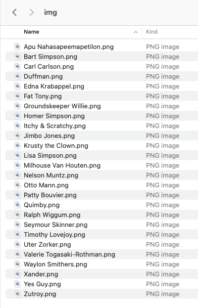
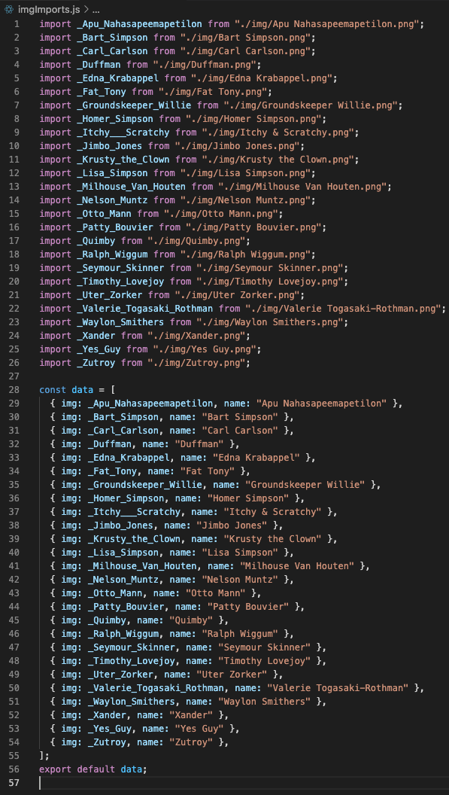

<!--
*** Thanks for checking out the Best-README-Template. If you have a suggestion
*** that would make this better, please fork the repo and create a pull request
*** or simply open an issue with the tag "enhancement".
*** Thanks again! Now go create something AMAZING! :D
-->

<!-- PROJECT SHIELDS -->
<!--
*** I'm using markdown "reference style" links for readability.
*** Reference links are enclosed in brackets [ ] instead of parentheses ( ).
*** See the bottom of this document for the declaration of the reference variables
*** for contributors-url, forks-url, etc. This is an optional, concise syntax you may use.
*** https://www.markdownguide.org/basic-syntax/#reference-style-links
-->

[![Contributors][contributors-shield]][contributors-url]
[![Forks][forks-shield]][forks-url]
[![Stargazers][stars-shield]][stars-url]
[![Issues][issues-shield]][issues-url]
[![MIT License][license-shield]][license-url]

<!-- [![LinkedIn][linkedin-shield]][linkedin-url] -->

<!-- PROJECT LOGO -->
<!-- <br />
<p align="center">
  <a href="https://github.com/oscadev/react-import-folder">
    
  </a>

  <h3 align="center">Best-README-Template</h3>

  <p align="center">
    An awesome README template to jumpstart your projects!
    <br />
    <a href="https://github.com/oscadev/react-import-folder"><strong>Explore the docs »</strong></a>
    <br />
    <br />
    <a href="https://github.com/oscadev/react-import-folder">View Demo</a>
    ·
    <a href="https://github.com/oscadev/react-import-folder/issues">Report Bug</a>
    ·
    <a href="https://github.com/oscadev/react-import-folder/issues">Request Feature</a>
  </p>
</p> -->

<!-- TABLE OF CONTENTS -->
<!-- <details open="open">
  <summary>Table of Contents</summary>
  <ol>
    <li>
      <a href="#about-the-project">About The Project</a>
      <ul>
        <li><a href="#built-with">Built With</a></li>
      </ul>
    </li>
    <li>
      <a href="#getting-started">Getting Started</a>
      <ul>
        <li><a href="#prerequisites">Prerequisites</a></li>
        <li><a href="#installation">Installation</a></li>
      </ul>
    </li>
    <li><a href="#usage">Usage</a></li>
    <li><a href="#roadmap">Roadmap</a></li>
    <li><a href="#contributing">Contributing</a></li>
    <li><a href="#license">License</a></li>
    <li><a href="#contact">Contact</a></li>
    <li><a href="#acknowledgements">Acknowledgements</a></li>
  </ol>
</details> -->

# react-import-folder

<!-- ABOUT THE PROJECT -->

## About The Project

<!-- [![Product Name Screen Shot][product-screenshot]](https://example.com) -->

Import image folders into React projects: Turn a folder with images into a js file that contains all of the import lines, as well as an array object of all of the images and their filenames (the filename part is useful if the files are already correctly named and you wish to use the names).

<div style="display:flex; flex-wrap: wrap; justify-content: center; align-items:center;">
</div>

I have had to work on projects that involve many countless images, and importing them is very tedious for these reasons:

- Having to type out all of the import statements for each image.
- Image names containing forbidden variable name characters, such as spaces or periods, so that I cant simply name the variable the same as the filename to cut on time importing.
- Having to tediously create the array object that uses these imports.

I then made this package to end the pain. (This was the original intent of programming!!)

<!-- GETTING STARTED -->

## Getting Started

Assumptions the package makes:

1. The "display name" feature assumes that the filenames contain the working display name that you wish to use. If you dont need the filenames at all, it doesnt matter what they are named in that case.

<!-- ### Prerequisites

This is an example of how to list things you need to use the software and how to install them.

- npm
  ```sh
  npm install npm@latest -g
  ```

<!-- ### Installation -->

### Installation

3. Install NPM package globally
   ```sh
   npm install -g react-import-folder
   ```

<!-- USAGE EXAMPLES -->

## Usage

1. cd into the folder that contains the react.js file you wish to import images into.

```sh
   cd ~/myprojects/myreactproject/src/etc
```

2. Then, type: [replace with your actual relative path to the images folder]

```sh
   react-import-folder ./relative/path/to/images
```

3. By default, it only looks for image files in the directory you point it to. If you want it to also search sub-directories, add the 'all' flag. It will add all images found in subdirectories to the array, and you can use the image object "folder" value to differentiate.

```sh
   react-import-folder ./relative/path/to/images all
```

This will create a new js file in the current directory called imgImports.js with all the imports filled in, as well as an array of objects that contain all the images, their display name, and the folder location they are in. Then, simply import the array object into your react js file that needs the images.

<!-- ROADMAP -->

## Roadmap

1. The package assumes that the image files are named with their correct intended display names such as Bruce Wayne.png (if you intend on using the display name at all). I will add support for dealing with badly named assets such as \_bruce-wayne.png.

See the [open issues](https://github.com/oscadev/react-import-folder/issues) for a list of proposed features (and known issues).

<!-- CONTRIBUTING -->

## Contributing

Contributions are what make the open source community such an amazing place to be learn, inspire, and create. Any contributions you make are **greatly appreciated**.

<!-- LICENSE -->

## License

Distributed under the MIT License. See `LICENSE` for more information.

<!-- CONTACT -->

## Contact

oscadev- oscadev@protonmail.com

Project Link: [https://github.com/oscadev/react-import-folder](https://github.com/oscadev/react-import-folder)

<!-- MARKDOWN LINKS & IMAGES -->
<!-- https://www.markdownguide.org/basic-syntax/#reference-style-links -->

[contributors-shield]: https://img.shields.io/github/contributors/oscadev/react-import-folder.svg?style=for-the-badge
[contributors-url]: https://github.com/oscadev/react-import-folder/graphs/contributors
[forks-shield]: https://img.shields.io/github/forks/oscadev/react-import-folder.svg?style=for-the-badge
[forks-url]: https://github.com/oscadev/react-import-folder/network/members
[stars-shield]: https://img.shields.io/github/stars/oscadev/react-import-folder.svg?style=for-the-badge
[stars-url]: https://github.com/oscadev/react-import-folder/stargazers
[issues-shield]: https://img.shields.io/github/issues/oscadev/react-import-folder.svg?style=for-the-badge
[issues-url]: https://github.com/oscadev/react-import-folder/issues
[license-shield]: https://img.shields.io/github/license/oscadev/react-import-folder.svg?style=for-the-badge
[license-url]: https://github.com/oscadev/react-import-folder/blob/master/LICENSE.txt

<!-- [linkedin-shield]: https://img.shields.io/badge/-LinkedIn-black.svg?style=for-the-badge&logo=linkedin&colorB=555 -->
<!-- [linkedin-url]: https://linkedin.com/in/othneildrew -->

[product-screenshot]: images/screenshot.png
